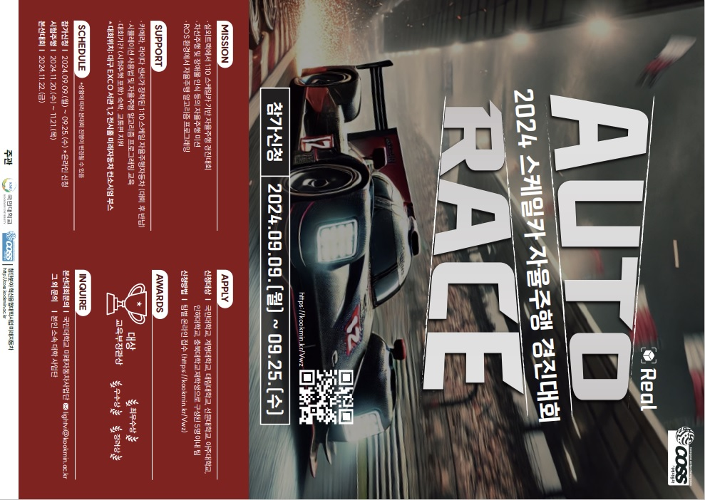

# AutoRace 2024 🏆 [교육부장관상](https://github.com/JaGyeong1024/JaGyeong1024/blob/main/assets/awards/2024-autorace.pdf) 수상 🏆



**AutoRace 2024 — 2024 스케일카 자율주행 경진대회**

- **일정**<br />시험주행 2024. 11. 20.(수) ~ 11. 21.(목), 본선 2024. 11. 22.(금)
- **장소**<br />대구 EXCO 서관 1, 2 전시홀 미래자동차 컨소시엄 부스 (CO-SHOW 2024)
- **참가 대학**<br />국민대, 계명대, 대림대, 선문대, 아주대, 인하대, 충북대
- **플랫폼**<br />카메라, 라이다 센서가 장착된 1:10 스케일 자율주행자동차
- **미션**<br />실외 트랙에서 차선 주행 및 장애물 인식 등 자율주행 미션, ROS 환경 알고리즘 개발
- **주관**<br />국민대학교, COSS 첨단분야 혁신융합대학사업 미래자동차

<br clear="right" />
<br />

<div align="center">
<table>
<tr>
<td align="center" valign="top" width="150">
  <a href="https://github.com/a1038562"></a><br />
  <a href="https://github.com/a1038562"><b>이지원</b></a>
</td>
<td align="center" valign="top" width="150">
  <a href="https://github.com/tjsdn3065"></a><br />
  <a href="https://github.com/tjsdn3065"><b>김선우</b></a>
</td>
<td align="center" valign="top" width="150">
  <a href="https://github.com/YSH-research"></a><br />
  <a href="https://github.com/YSH-research"><b>윤수한</b></a>
</td>
<td align="center" valign="top" width="150">
  <a href="https://github.com/ttaehyun"></a><br />
  <a href="https://github.com/ttaehyun"><b>유태현</b></a>
</td>
<td align="center" valign="top" width="150">
  <a href="https://github.com/JaGyeong1024"></a><br />
  <a href="https://github.com/JaGyeong1024"><b>구자경</b></a>
</td>
</tr>
</table>
</div>

<br />

## 프로젝트 개요

카메라와 2D 라이다로 미션 구간을 인식하고, 각 미션 노드가 우선순위가 다른 `ackermann_cmd_mux` 입력으로 주행 명령을 보냅니다.

## Missions

| Mission | Sensor | Behavior | Node |
|---|---|---|---|
| Lane following | Camera | Bird's-eye view warp, sliding window lane fitting | `lane_main.py` |
| Barricade | LiDAR | Stops when the barricade is down and starts when it lifts; ignores walls and other obstacles | `barricade_detector.py` |
| Rubber cone | LiDAR | Follows the center path between left and right cones from `obstacle_detector` | `rubber_cone.py` |
| Tunnel | LiDAR | PID steering on left and right wall distances | `tunnel.py` |
| Red road | Camera | Slows down on the red road section | `red_road_node` |
| Crosswalk | Camera | Stops for 5 s at the stop line, then continues | `crosswalk.py` |
| A/B choice | Camera (AR marker) | Picks the left or right lane from the AR marker ID | `choice_AB.py` |
| Roundabout | LiDAR | Sets the direction flag (`/direction_flag`) from the motion of the circulating vehicle cluster | `round_about_node`, `arrow_cluster_node` |
| Parking | Camera | Detects the parking spot, then runs a forward/reverse sequence | `parking_rect.py` |

## Command Priority

Every mission node publishes to `high_level/ackermann_cmd_mux` in `racecar`. When several inputs are active, the one with the highest priority wins (`catkin_ws/src/racecar/racecar/config/racecar-v2/high_level_mux.yaml`).

| Input | Priority | Node |
|---|---|---|
| `input/nav_0` | 20 | `parking_rect.py` |
| `input/nav_1` | 18 | `rubber_cone.py` |
| `input/nav_2` | 15 | `red_road_node` |
| `input/nav_3` | 12 | `barricade_detector.py` |
| `input/nav_4` | 10 | `crosswalk.py` |
| `input/nav_5` | 8 | `tunnel.py` |
| `input/nav_6` | 5 | `lane_main.py` |

## Layout

| Path | Contents |
|---|---|
| `catkin_ws/` | Vehicle base stack: sensor drivers, VESC, ackermann mux, teleop |
| `webot_ws/` | Competition mission packages |

## Packages

`webot_ws/src`:

| Package | Role |
|---|---|
| `lane_detection` | Lane following and camera/LiDAR mission nodes, full launch (`start.launch`) |
| `barricade_detector` | Barricade detection |
| `red_road` | Red road detection |
| `roundAboutNav` | Roundabout LiDAR clustering and direction flag |
| `image_undistort_pkg` | Camera undistortion (`/usb_cam/image_raw` → `/usb_cam/image_raw/calib`) |
| `ar_track_alvar` | AR marker tracking |

`catkin_ws/src`:

| Package | Role |
|---|---|
| `racecar` | Vehicle bringup, `ackermann_cmd_mux` |
| `vesc` | VESC motor driver |
| `rplidar_ros` | RPLiDAR driver |
| `usb_cam` | USB camera driver |
| `razor_imu_9dof` | IMU driver |
| `obstacle_detector` | LiDAR obstacle extraction (`/raw_obstacles`) |
| `fiducials`, `image_pipeline` | Fiducial marker detection, camera calibration |
| `wego` | Teleop and sensor view rviz launch |

## Build

Ubuntu 20.04 + ROS Noetic.

```bash
cd catkin_ws && catkin_make && source devel/setup.bash
cd ../webot_ws && catkin_make && source devel/setup.bash
```

## Run

```bash
roslaunch wego teleop.launch              # vehicle bringup (VESC, RPLiDAR, USB camera, mux, joystick)
roslaunch lane_detection start.launch     # all mission nodes
```
